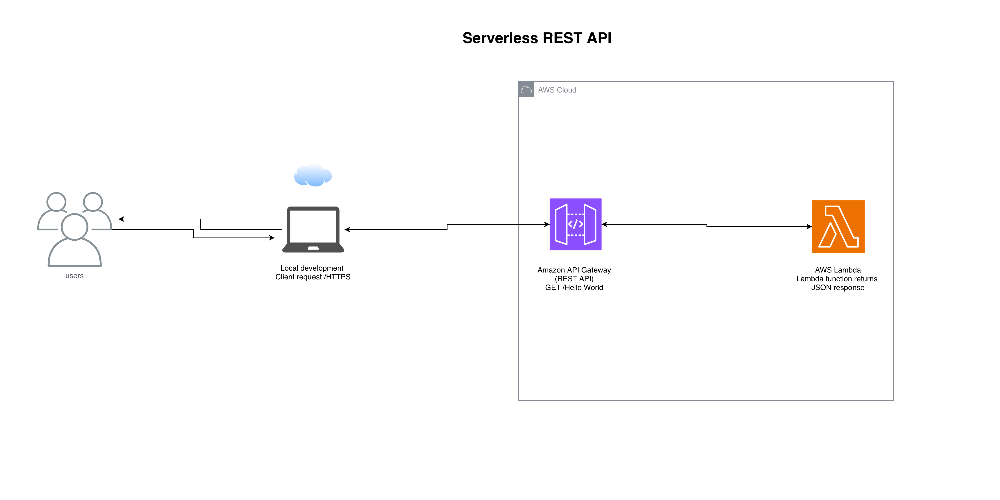

# Serverless REST API on AWS

This project implements a serverless REST API using AWS managed services.

## Architecture Diagram

## Services Used
- Amazon API Gateway
- AWS Lambda
- AWS CloudWatch (logging)
- AWS IAM (permissions)

## Architecture Flow
1. Client sends an HTTPS request to API Gateway.
2. API Gateway invokes a Lambda function.
3. Lambda processes the request and returns a response.
4. API Gateway sends the HTTPS response back to the client.

## Key Benefits
- No server management
- Automatic scaling
- Secure HTTPS endpoints
- Cost-efficient, event-driven architecture
